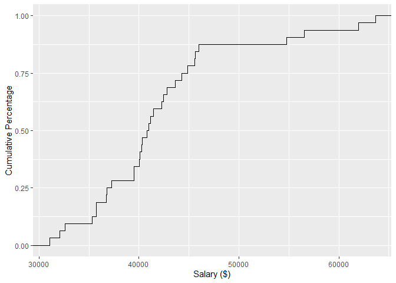

Chapter 1: Plots (advanced: with `ggplot2`)
================

# Employees of a Small Business Company: Categorical Data

-   reading data:

``` r
EX_DATA_DF <- readRDS("../data/EX_DATA_DF.rds")
EX_DATA_DF$Years <- floor(EX_DATA_DF$Months/12)
library(tidyverse)
```

    ## -- Attaching packages --------------------------------------- tidyverse 1.3.1 --

    ## v ggplot2 3.3.5     v purrr   0.3.4
    ## v tibble  3.1.6     v dplyr   1.0.7
    ## v tidyr   1.1.4     v stringr 1.4.0
    ## v readr   2.1.0     v forcats 0.5.1

    ## -- Conflicts ------------------------------------------ tidyverse_conflicts() --
    ## x dplyr::filter() masks stats::filter()
    ## x dplyr::lag()    masks stats::lag()

-   bar chart

``` r
EX_DATA_DF %>% 
  ggplot(aes(Degree)) +    # plotted variable
  geom_bar(fill="grey") +  # type of plot
  labs(x="Academic Degree", y= "Frequency")  #x,y-labs 
```

<!-- -->
- Pareto Chart

``` r
library(ggQC)
EX_DATA_DF %>% 
  group_by(Degree) %>%            # variable of interest
  summarise(Frequency=n()) %>%    # we need its frequency distribution
  ggplot(aes(x = Degree, y = Frequency)) + # plotted variables
  labs(x = "Academic Degree", y = "Frequency")+
  stat_pareto(bars.fill = "grey")
```

<!-- -->
- Grouped Bar Charts

``` r
EX_DATA_DF %>% 
  ggplot(aes(x = Gender, fill = Degree ))  + # plotted variables
  geom_bar(stat="count", position = "dodge")  
```

<!-- -->
- Component Bar Charts

``` r
EX_DATA_DF %>% 
  ggplot(aes(x = Gender, fill = Degree ))  + # plotted variables
  geom_bar(stat="count", position = "stack")  
```

<!-- -->
- Percent Stacked Bar Chart

``` r
EX_DATA_DF %>% 
  ggplot(aes(x = Gender, fill = Degree ))  + # plotted variables
  geom_bar(stat="count", position = "fill")    
```

<!-- -->
- Mosaic Plot

``` r
library(ggmosaic)
EX_DATA_DF %>% 
  ggplot()+
  geom_mosaic(aes(x = product(Degree, Gender), fill = Degree))
```

<!-- -->
- Pie Chart

``` r
EX_DATA_DF %>% 
  ggplot(aes(x="", fill=Degree)) +
  geom_bar(stat="count")+
  coord_polar("y")
```

<!-- -->

# Employees of a Small Business Company: Numerical Data

-   Bar chart

``` r
EX_DATA_DF %>% 
  mutate(Children=factor(Children,levels = 0:5)) %>% 
  ggplot(aes(Children)) +    
  scale_x_discrete(limits=factor(0:5)) +
  geom_bar(fill="grey") +  
  labs(x="Number of Children", y= "Frequency")  
```

<!-- -->
- Dot plot

``` r
EX_DATA_DF %>% 
  ggplot(aes(x = Years))+ 
  geom_dotplot(binwidth = .25,  stackdir = "center", stackratio = 1.5) +
  scale_y_continuous(NULL, breaks = NULL)
```

<!-- -->
- Histogram

``` r
EX_DATA_DF %>% 
  ggplot(aes(Salary)) +
  geom_histogram(breaks=seq(30000,65000,5000), fill = "grey") 
```

<!-- -->
- Ogive

``` r
EX_DATA_DF %>% 
  ggplot(aes(Salary)) + 
  stat_ecdf(geom = "step")+
  labs(x ="Salary ($)",y="Cumulative Percentage")
```

<!-- -->
- Scatter Plot

``` r
EX_DATA_DF %>% 
  ggplot(aes(x=Years, y=Salary)) +
  geom_point()+
  labs(y ="Salary ($)",x="Duration (years)")+
  expand_limits(x = 0)
```

<!-- -->
