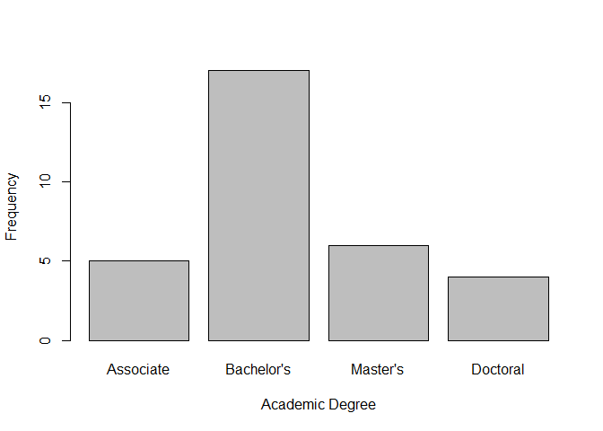

Chapter 1: Plots (simple)
================

# Employees of a Small Business Company: Categorical Data

-   reading data:

``` r
EX_DATA_DF <- readRDS("../data/EX_DATA_DF.rds")
EX_DATA_DF$Years <- floor(EX_DATA_DF$Months/12)
```

-   bar chart using plot or barplot

``` r
plot(EX_DATA_DF$Degree, xlab = "Academic Degree", ylab = "Frequency")
barplot(table(EX_DATA_DF$Degree), xlab = "Academic Degree", ylab = "Frequency")
```

<!-- -->
- Pareto Chart

``` r
qcc::pareto.chart(table(EX_DATA_DF$Degree), main =" Pareto Chart for Degree")
```

<!-- -->

    ##             
    ## Pareto chart analysis for table(EX_DATA_DF$Degree)
    ##              Frequency Cum.Freq. Percentage Cum.Percent.
    ##   Bachelor's    17.000    17.000     53.125       53.125
    ##   Master's       6.000    23.000     18.750       71.875
    ##   Associate      5.000    28.000     15.625       87.500
    ##   Doctoral       4.000    32.000     12.500      100.000

-   Grouped Bar Charts

``` r
barplot(table(EX_DATA_DF$Degree,EX_DATA_DF$Gender), beside = TRUE)
```

<!-- -->
- Component Bar Charts

``` r
barplot(table(EX_DATA_DF$Degree,EX_DATA_DF$Gender), beside = FALSE)
```

<!-- -->
- Spine Plot

``` r
spineplot(table(EX_DATA_DF$Gender,EX_DATA_DF$Degree), main = "Spine Plot for Company Employee Data")
```

<!-- -->
- or Mosaic Plot

``` r
mosaicplot(table(EX_DATA_DF$Gender,EX_DATA_DF$Degree), main = "Mosaic Plot for Company Employee Data")
```

<!-- -->
- Pie Chart

``` r
pie(table(EX_DATA_DF$Degree))
```

<!-- -->

# Employees of a Small Business Company: Numerical Data

-   Bar chart

``` r
plot(table(EX_DATA_DF$Children))
```

<!-- -->

``` r
barplot(table(factor(EX_DATA_DF$Children, levels = 0:5)))
```

<!-- -->
- Dot plot

``` r
stripchart(EX_DATA_DF$Years, method = "stack", offset = 0.5, pch=19)
```

<!-- -->
- Histogram

``` r
hist(EX_DATA_DF$Salary,breaks = 8, main = "Histogram of Employee Salaries", xlab = "Salary")
```

<!-- -->
- Ogive

``` r
plot(ecdf(EX_DATA_DF$Salary),verticals = FALSE)
```

<!-- -->

``` r
plot(actuar::ogive(EX_DATA_DF$Salary), main = "Ogive for Grouped Data")
```

<!-- -->
- Scatter Plot

``` r
plot(EX_DATA_DF$Years,EX_DATA_DF$Salary, xlab = "Duration", ylab = "Salary")
```

<!-- -->
