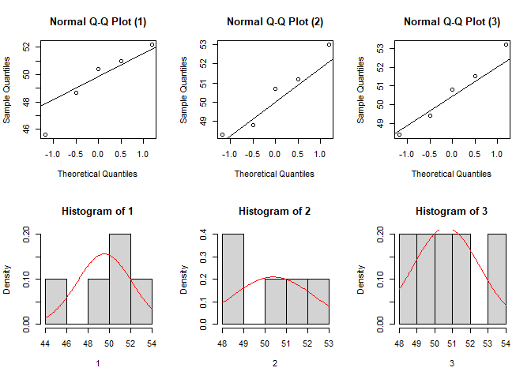
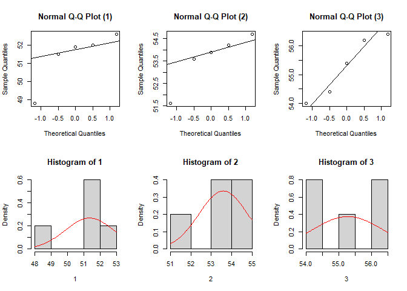

Chapter 7: ANOVA
================

# One-Way ANOVA with `onewaytests` package

## Male Runners (no difference)

-   reading data (you can use both: `.rds` or `.csv`):

``` r
MaleRunners <- readRDS("../data/MaleRunners.rds")
#MaleRunners <- read.csv("../data/MaleRunners.csv")
#MaleRunners$program <- as.factor(MaleRunners$program)
```

-   program is a factor with three levels

``` r
str(MaleRunners)
```

    ## 'data.frame':    15 obs. of  2 variables:
    ##  $ time   : num  45.6 48.3 48.4 48.7 48.8 49.4 50.4 50.7 50.8 51 ...
    ##  $ program: Factor w/ 3 levels "1","2","3": 1 2 3 1 2 3 1 2 3 1 ...

``` r
library(tidyverse)
library(pander)
MaleRunners %>% 
  group_by(program) %>% 
  summarize(n=n(),Mean = mean(time),Std = sd(time)) %>% 
  pander()
```

| program |  n  | Mean  |  Std  |
|:-------:|:---:|:-----:|:-----:|
|    1    |  5  | 49.58 | 2.558 |
|    2    |  5  | 50.4  | 1.901 |
|    3    |  5  | 50.66 | 1.862 |

-   let us assess normality assumption (Shapiro-Wilk Tests by default):

``` r
library(onewaytests)
nor.test(formula = time ~ program, data = MaleRunners, alpha = 0.05)
```

    ## 
    ##   Shapiro-Wilk Normality Test (alpha = 0.05) 
    ## -------------------------------------------------- 
    ##   data : time and program 
    ## 
    ##   Level Statistic   p.value   Normality
    ## 1     1 0.9332339 0.6185833  Not reject
    ## 2     2 0.9483207 0.7251867  Not reject
    ## 3     3 0.9853467 0.9610184  Not reject
    ## --------------------------------------------------

<!-- -->

-   and homogeneity assumption:

``` r
homog.test(formula = time ~ program, data = MaleRunners, 
           method = "Bartlett", alpha = 0.05)
```

    ## 
    ##   Bartlett's Homogeneity Test (alpha = 0.05) 
    ## ----------------------------------------------- 
    ##   data : time and program 
    ## 
    ##   statistic  : 0.4786895 
    ##   parameter  : 2 
    ##   p.value    : 0.7871435 
    ## 
    ##   Result     : Variances are homogeneous. 
    ## -----------------------------------------------

-   ANOVA F-test (fail to reject *H*<sub>0</sub>)

``` r
aov.test(formula = time ~ program, data = MaleRunners, alpha = 0.05) 
```

    ## 
    ##   One-Way Analysis of Variance (alpha = 0.05) 
    ## ------------------------------------------------------------- 
    ##   data : time and program 
    ## 
    ##   statistic  : 0.3497982 
    ##   num df     : 2 
    ##   denom df   : 12 
    ##   p.value    : 0.7117836 
    ## 
    ##   Result     : Difference is not statistically significant. 
    ## -------------------------------------------------------------

-   At 5% significance level, there is insufficient evidence to conclude
    that the means of the three populations are not equal.

## Female Runners (a difference exists)

-   reading data:

``` r
FemaleRunners <- readRDS("../data/FemaleRunners.rds")
#FemaleRunners <- read.csv("../data/FemaleRunners.csv")
#FemaleRunners$program <- as.factor(FemaleRunners$program)
```

-   program is a factor with three levels

``` r
str(FemaleRunners)
```

    ## 'data.frame':    15 obs. of  2 variables:
    ##  $ time   : num  48.8 51.5 51.6 51.9 52 52.6 53.6 53.9 54 54.2 ...
    ##  $ program: Factor w/ 3 levels "1","2","3": 1 1 2 1 1 1 2 2 3 2 ...

``` r
FemaleRunners %>% 
  group_by(program) %>% 
  summarize(n=n(),Mean = mean(time),Std = sd(time)) %>% 
  pander()
```

| program |  n  | Mean  |  Std  |
|:-------:|:---:|:-----:|:-----:|
|    1    |  5  | 51.36 | 1.484 |
|    2    |  5  | 53.6  | 1.19  |
|    3    |  5  | 55.28 | 1.064 |

-   normality assumption

``` r
nor.test(formula = time ~ program, data = FemaleRunners, alpha = 0.05)
```

    ## 
    ##   Shapiro-Wilk Normality Test (alpha = 0.05) 
    ## -------------------------------------------------- 
    ##   data : time and program 
    ## 
    ##   Level Statistic    p.value   Normality
    ## 1     1 0.7947063 0.07332009  Not reject
    ## 2     2 0.8591691 0.22528036  Not reject
    ## 3     3 0.9097182 0.46589886  Not reject
    ## --------------------------------------------------

<!-- -->

-   *Example 7.3*: homogeneity assumption (Bartlett’s)

``` r
homog.test(formula = time ~ program, data = FemaleRunners, 
           method = "Bartlett", alpha = 0.05)
```

    ## 
    ##   Bartlett's Homogeneity Test (alpha = 0.05) 
    ## ----------------------------------------------- 
    ##   data : time and program 
    ## 
    ##   statistic  : 0.4235811 
    ##   parameter  : 2 
    ##   p.value    : 0.8091342 
    ## 
    ##   Result     : Variances are homogeneous. 
    ## -----------------------------------------------

-   *Example 7.4*: homogeneity assumption (Levene)

``` r
homog.test(formula = time ~ program, data = FemaleRunners,
                alpha = 0.05, method = "Levene") # location parameter = mean
```

    ## 
    ##   Levene's Homogeneity Test (alpha = 0.05) 
    ## ----------------------------------------------- 
    ##   data : time and program 
    ## 
    ##   statistic  : 0.1170347 
    ##   num df     : 2 
    ##   denum df   : 12 
    ##   p.value    : 0.8905572 
    ## 
    ##   Result     : Variances are homogeneous. 
    ## -----------------------------------------------

-   ANOVA F-test (reject *H*<sub>0</sub>)

``` r
aov.test(formula = time ~ program, data = FemaleRunners, alpha = 0.05)
```

    ## 
    ##   One-Way Analysis of Variance (alpha = 0.05) 
    ## ------------------------------------------------------------- 
    ##   data : time and program 
    ## 
    ##   statistic  : 12.21389 
    ##   num df     : 2 
    ##   denom df   : 12 
    ##   p.value    : 0.001277881 
    ## 
    ##   Result     : Difference is statistically significant. 
    ## -------------------------------------------------------------

-   The data provide sufficient evidence that there is a significant
    difference between mean female finishing time for the three training
    programs (at *α* = 0.05).

# Post Hoc Analysis

-   *Example 7.2*: multiple comparison with Holm correction

``` r
Anova_Female = aov.test(formula = time ~ program, data = FemaleRunners, alpha = 0.05, verbose = FALSE)
paircomp(Anova_Female, adjust.method = "holm")
```

    ## 
    ##   Holm Correction (alpha = 0.05) 
    ## ----------------------------------------------------- 
    ##   Level (a) Level (b)     p.value   No difference
    ## 1         1         2 0.060048835      Not reject
    ## 2         1         3 0.004067648          Reject
    ## 3         2         3 0.060048835      Not reject
    ## -----------------------------------------------------

-   Recommended Tukey-Kramer Test:

``` r
TukeyHSD( aov(formula = time ~ program, data = FemaleRunners) )
```

    ##   Tukey multiple comparisons of means
    ##     95% family-wise confidence level
    ## 
    ## Fit: aov(formula = time ~ program, data = FemaleRunners)
    ## 
    ## $program
    ##     diff        lwr      upr     p adj
    ## 2-1 2.24  0.1168543 4.363146 0.0385738
    ## 3-1 3.92  1.7968543 6.043146 0.0009437
    ## 3-2 1.68 -0.4431457 3.803146 0.1291909

-   We conclude that to achieve better times, women should choose
    between program 1 and 2.
