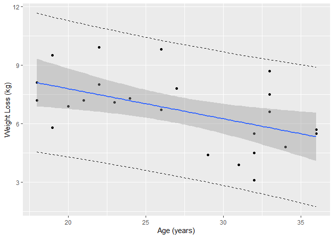
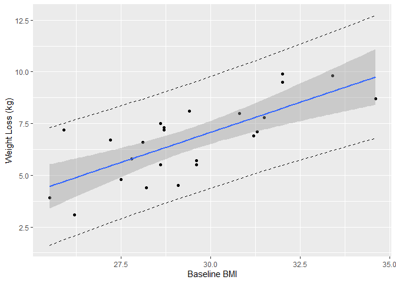
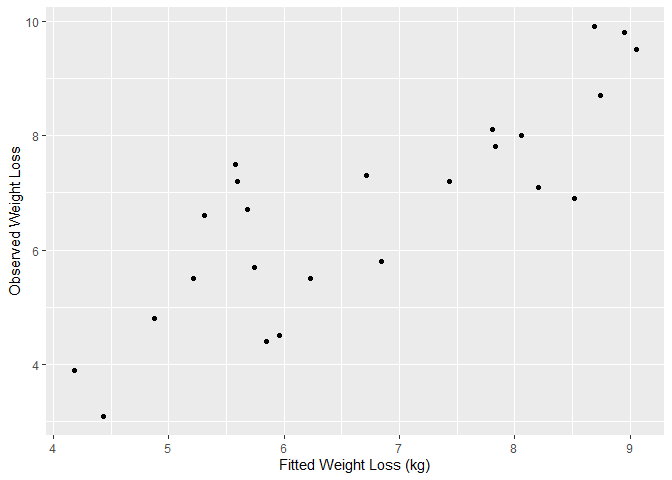
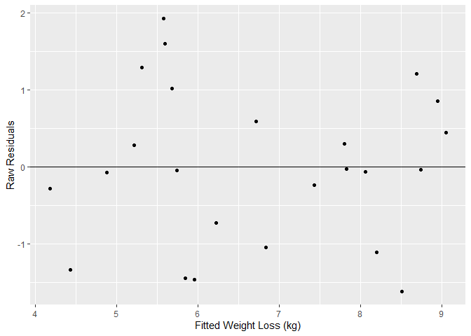
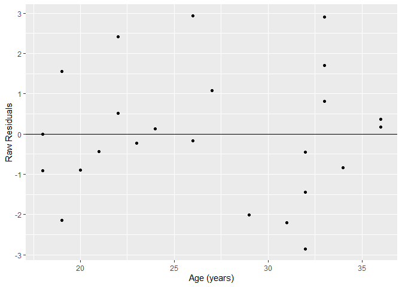
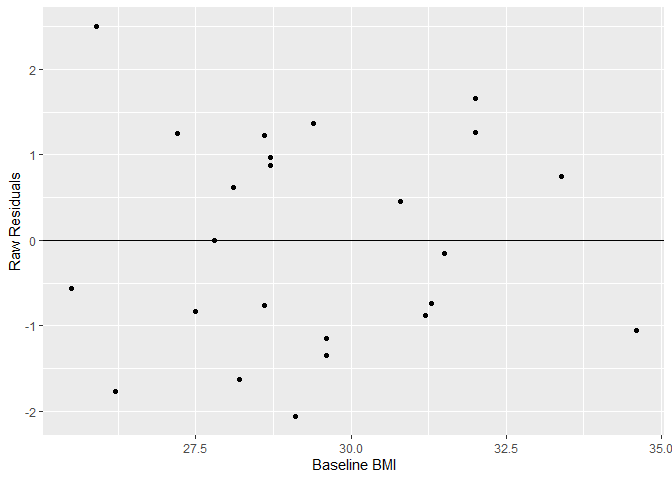
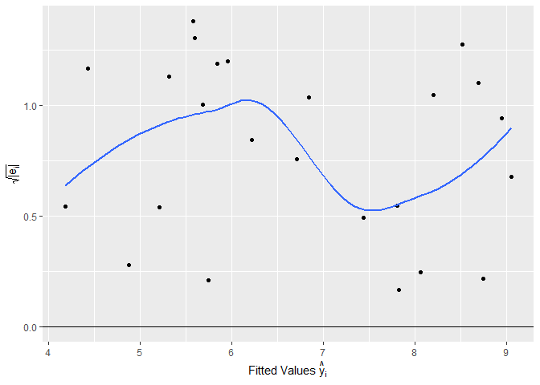
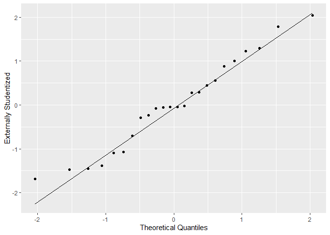

Chapter 11: Multiple Linear Regression
================

## Section 11.1: Multiple Linear Regression Model

### data (Four-Month Weight Loss Program)

``` r
library(pander) #nice tables
library(tidyverse) # %>%  and ggplot2
DFMLM <- readRDS("../data/WeightLossData.rds")
DFMLM[c(1:3,23:24),] %>% pander
```

|        | Age | Weight | BMI  | Fat  | ExerciseTime | WeightLoss |
|:------:|:---:|:------:|:----:|:----:|:------------:|:----------:|
| **1**  | 33  |   80   | 28.1 | 36.5 |   Morning    |    6.6     |
| **2**  | 27  |  96.5  | 31.5 | 44.3 |  Afternoon   |    7.8     |
| **3**  | 22  |   87   | 30.8 | 42.1 |   Morning    |     8      |
| **23** | 33  |  99.8  | 34.6 | 48.9 |  Afternoon   |    8.7     |
| **24** | 36  |  77.7  | 29.6 | 39.7 |  Afternoon   |    5.7     |

### matrix form

``` r
X <- matrix(c(rep(1,24), DFMLM$Age, DFMLM$BMI), nrow=24)
Y <- DFMLM$WeightLoss
round( solve(t(X) %*%  X) %*% t(X) %*% Y , 3)
```

    ##        [,1]
    ## [1,] -5.530
    ## [2,] -0.120
    ## [3,]  0.527

## Estimated regression equations

### MLM: total weight loss as a linear function of Age and BMI

``` r
(MLM_Age_BMI <- lm(formula = WeightLoss ~ Age + BMI, data = DFMLM))
```

    ## 
    ## Call:
    ## lm(formula = WeightLoss ~ Age + BMI, data = DFMLM)
    ## 
    ## Coefficients:
    ## (Intercept)          Age          BMI  
    ##     -5.5298      -0.1204       0.5273

### SLM: total weight loss as a linear function of Age

``` r
SLM_Age <- lm(formula = WeightLoss ~ Age, data = DFMLM)
summary(SLM_Age)$coefficients
```

    ##               Estimate Std. Error   t value     Pr(>|t|)
    ## (Intercept) 10.8744370 1.50776094  7.212308 3.154991e-07
    ## Age         -0.1540038 0.05467126 -2.816907 1.004216e-02

``` r
summary(SLM_Age)$r.squared
```

    ## [1] 0.2650735

-   plot:

``` r
temp_var_Age <- predict(SLM_Age, interval = "prediction")  #lwr and upper
new_df_Age <- cbind(DFMLM, temp_var_Age)

ggplot(new_df_Age,  aes(x = Age, y = WeightLoss))+
  geom_point() + #data
  geom_line(aes(y=lwr), linetype = "dashed")+ #prediction - lower
  geom_line(aes(y=upr), linetype = "dashed")+ #prediction - upper
  geom_smooth(method = "lm", se = TRUE) +# confidence
  labs(x="Age (years)",y="Weight Loss (kg)")
```

<!-- -->

### SLM: total weight loss as a linear function of BMI

``` r
SLM_BMI <- lm(formula = WeightLoss ~ BMI, data = DFMLM)
summary(SLM_BMI)$coefficients
```

    ##                Estimate Std. Error   t value     Pr(>|t|)
    ## (Intercept) -10.3450989  3.3682859 -3.071325 5.586943e-03
    ## BMI           0.5808397  0.1142426  5.084264 4.297012e-05

``` r
summary(SLM_BMI)$r.squared
```

    ## [1] 0.5402274

-   plot:

``` r
temp_var_BMI <- predict(SLM_BMI, interval = "prediction") #lwr and upper
new_df_BMI<- cbind(DFMLM, temp_var_BMI)


ggplot(new_df_BMI,  aes(x = BMI, y = WeightLoss))+
  geom_point() + #data
  geom_line(aes(y=lwr), linetype = "dashed")+ #prediction - lower
  geom_line(aes(y=upr), linetype = "dashed")+ #prediction - upper
  geom_smooth(method = "lm", se = TRUE) +# confidence
  labs(x="Baseline BMI",y="Weight Loss (kg)")
```

<!-- -->

-   Correlation Coefficients for Weight Loss Data

``` r
cor(DFMLM[c('Age','BMI','Fat','WeightLoss')]) %>% pander
```

|                |   Age   |   BMI   |   Fat   | WeightLoss |
|:--------------:|:-------:|:-------:|:-------:|:----------:|
|    **Age**     |    1    | -0.1685 | -0.1725 |  -0.5149   |
|    **BMI**     | -0.1685 |    1    | 0.9815  |   0.735    |
|    **Fat**     | -0.1725 | 0.9815  |    1    |   0.7137   |
| **WeightLoss** | -0.5149 |  0.735  | 0.7137  |     1      |

### MLM: total weight loss as a linear function of BMI and Fat

``` r
(MLM_BMI_Fat <- lm(formula = WeightLoss ~ BMI+Fat, data = DFMLM))
```

    ## 
    ## Call:
    ## lm(formula = WeightLoss ~ BMI + Fat, data = DFMLM)
    ## 
    ## Coefficients:
    ## (Intercept)          BMI          Fat  
    ##   -11.32475      0.74531     -0.09746

### Residuals for Age-BMI-MLM

-   estimate of total weight loss for a 33-year-old woman with her
    starting BMI of 28.1:

``` r
predict(object = MLM_Age_BMI,newdata = data.frame(Age = 33, BMI = 28.1))
```

    ##        1 
    ## 5.313587

-   fitted values

``` r
head(fitted(MLM_Age_BMI))
```

    ##        1        2        3        4        5        6 
    ## 5.313587 7.828583 8.061419 4.876845 5.847849 7.435703

### Residual calculations

``` r
sigma(MLM_Age_BMI)   # point estimate of sigma (square root of SSE)
```

    ## [1] 1.056197

``` r
head(hatvalues(MLM_Age_BMI))   # leverages
```

    ##          1          2          3          4          5          6 
    ## 0.09124755 0.07859439 0.07945551 0.11691908 0.05605444 0.14675756

``` r
head(residuals(MLM_Age_BMI))   # raw residuals
```

    ##           1           2           3           4           5           6 
    ##  1.28641320 -0.02858337 -0.06141881 -0.07684529 -1.44784857 -0.23570253

``` r
head(rstandard(MLM_Age_BMI))    # internally studentized
```

    ##           1           2           3           4           5           6 
    ##  1.27765295 -0.02819312 -0.06060859 -0.07742339 -1.41092809 -0.24159239

``` r
head(rstudent(MLM_Age_BMI))     # externally studentized 
```

    ##           1           2           3           4           5           6 
    ##  1.29834456 -0.02751419 -0.05915310 -0.07556828 -1.44722822 -0.23609836

## Section 11.2: Statistical Inference and Regression Validation

``` r
V <- round((solve(t(X) %*%  X)),3); V
```

    ##        [,1]   [,2]   [,3]
    ## [1,]  8.909 -0.048 -0.258
    ## [2,] -0.048  0.001  0.001
    ## [3,] -0.258  0.001  0.008

### t-tests for individual significance

``` r
summary(MLM_Age_BMI)$coefficients
```

    ##               Estimate Std. Error   t value     Pr(>|t|)
    ## (Intercept) -5.5298285 3.15259867 -1.754054 9.400491e-02
    ## Age         -0.1203839 0.03641488 -3.305897 3.363193e-03
    ## BMI          0.5272627 0.09620517  5.480607 1.944859e-05

### 95% confidence intervals for model parameters

``` r
confint(object = MLM_Age_BMI, level = 0.95)
```

    ##                   2.5 %      97.5 %
    ## (Intercept) -12.0860164  1.02635932
    ## Age          -0.1961128 -0.04465497
    ## BMI           0.3271931  0.72733236

### F-test for overall significance

``` r
SST=sum((DFMLM$WeightLoss-mean(DFMLM$WeightLoss))^2)
SSR=sum((mean(DFMLM$WeightLoss)-fitted(MLM_Age_BMI))^2)
SSE=sum((DFMLM$WeightLoss-fitted(MLM_Age_BMI))^2)
Fobs <- SSR/2/(SSE/(24-3))
c(SST,SSR,SSE,Fobs)
```

    ## [1] 77.46958 54.04300 23.42658 24.22255

``` r
(Fpval <- 1-pf(Fobs,2,21))
```

    ## [1] 3.516133e-06

``` r
summary(MLM_Age_BMI)$fstatistic
```

    ##    value    numdf    dendf 
    ## 24.22255  2.00000 21.00000

### Coefficients of Determination

-   multiple coefficient of determination

``` r
summary(MLM_Age_BMI)$r.squared
```

    ## [1] 0.6976029

-   adjusted multiple coefficient of determination

``` r
summary(MLM_Age_BMI)$adj.r.squared
```

    ## [1] 0.6688032

## Estimation and Prediction

-   a 99% confidence interval for mean weight loss among 30-year-old
    women with starting BMI of 31

``` r
newAge_BMI = data.frame(Age = 30, BMI = 31) 
predict(object = MLM_Age_BMI, newdata = newAge_BMI, 
        interval = "confidence", level = 0.99)
```

    ##      fit      lwr      upr
    ## 1 7.2038 6.360343 8.047258

-   prediction interval for weight loss for a 30-year-old woman with
    starting BMI of 31 with 99% probability:

``` r
predict(object = MLM_Age_BMI, newdata = newAge_BMI, 
        interval = "prediction", level = 0.99)
```

    ##      fit      lwr      upr
    ## 1 7.2038 4.096656 10.31094

## Checking Model Assumptions

### Residual Plots

-   Response against Fitted

``` r
DFMLMplot <- DFMLM
DFMLMplot$fitted <- fitted(MLM_Age_BMI)

ggplot(DFMLMplot, aes(fitted,WeightLoss)) +
  geom_point() +
  labs(y ="Observed Weight Loss",x="Fitted Weight Loss (kg)")
```

<!-- -->

-   Raw residuals against fitted

``` r
DFMLMplot$residuals <- residuals(MLM_Age_BMI)
ggplot(DFMLMplot, aes(fitted, residuals)) +
  geom_hline(yintercept = 0) +
  geom_point() +
  labs(x="Fitted Weight Loss (kg)", y="Raw Residuals")
```

<!-- -->

-   Residuals against Age

``` r
DFMLMplot$residuals_AGe <- residuals(SLM_Age)
ggplot(DFMLMplot, aes(Age, residuals_AGe)) +
  geom_hline(yintercept = 0) +
  geom_point() +
  labs(x="Age (years)", y="Raw Residuals")
```

<!-- -->

-   Residuals against Baseline BMI

``` r
DFMLMplot$residuals_BMI <- residuals(SLM_BMI)
ggplot(DFMLMplot, aes(BMI, residuals_BMI)) +
  geom_hline(yintercept = 0) +
  geom_point() +
  labs(x="Baseline BMI", y="Raw Residuals")
```

<!-- -->

-   Scale-Location Plot

``` r
DFMLMplot$scaleres <- sqrt(abs(rstandard(MLM_Age_BMI)))
ggplot(DFMLMplot, aes(fitted, scaleres)) +
  geom_point() +
  geom_hline(yintercept = 0) +
  geom_smooth(se = FALSE)+
  labs(x=expression(paste("Fitted Values ",hat(y)[i])), 
       y=expression(paste(sqrt(abs(e[i])))))
```

<!-- -->

-   Normal QQ Plot

``` r
DFMLMplot$stdres_ext <- rstudent(MLM_Age_BMI)
ggplot(DFMLMplot, aes(sample = stdres_ext)) +
  geom_qq_line()+ 
  stat_qq(distribution = stats::qnorm) +
  labs(y="Externally Studentized",x="Theoretical Quantiles")
```

<!-- -->

-   Testing normality with Shapiro test

``` r
shapiro.test(rstudent(MLM_Age_BMI))
```

    ## 
    ##  Shapiro-Wilk normality test
    ## 
    ## data:  rstudent(MLM_Age_BMI)
    ## W = 0.96469, p-value = 0.5396

-   Influential observations

``` r
max(MAXstudentized <- abs(rstudent(MLM_Age_BMI)))
```

    ## [1] 2.042755

``` r
DFMLM[which.max(MAXstudentized),]
```

    ##   Age Weight  BMI  Fat ExerciseTime WeightLoss
    ## 7  33   80.3 28.6 38.5      Morning        7.5

``` r
max(MAXleverage <- hatvalues(MLM_Age_BMI))
```

    ## [1] 0.3438564

``` r
DFMLM[which.max(MAXleverage),]
```

    ##    Age Weight  BMI  Fat ExerciseTime WeightLoss
    ## 23  33   99.8 34.6 48.9    Afternoon        8.7

``` r
(Cook_mean_3 <- mean(cooks.distance(model = MLM_Age_BMI))*3)
```

    ## [1] 0.128248

``` r
DFMLM[cooks.distance(model = MLM_Age_BMI) > Cook_mean_3,]
```

    ##    Age Weight  BMI Fat ExerciseTime WeightLoss
    ## 20  21   64.9 25.9  34      Morning        7.2

``` r
cooks.distance(model = MLM_Age_BMI)[20]
```

    ##        20 
    ## 0.2515387
